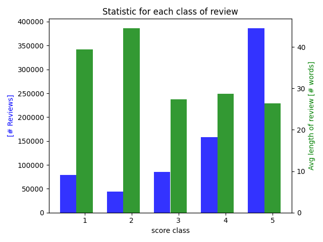

# Android App Reviews Classification

1. [ Description. ](#desc)
2. [ Environment and commands. ](#commands)
3. [ Links. ](#links)

## Description
In this task we want to build a model which gives the best accuracy in predicting the score of a given Google App review.
The score (or number of stars) of a review goes from bad (1 start) to fantastic (5 stars); it is represented by a value in [1,..,5].

> The documented implementation can be found in `main.py` and the hyper-parameters used for the experiment in `config.json`. Some stats about the dataset are done in `analysis.py`. All the logs of the experiments are stored in `results/`.

#### Dataset

The AAR dataset contains 752'936 entries. Each entries has a `review`, a summary, a `score`, and some unused meta-information.

**Some important facts:**
- The dataset is not *balanced*: there are 44k reviews with a score of 2 and 380k reviews with a score of 5 (see figure).
- It contains cased characters (A-Z). As the user probably take the task of writing reviews a bit more seriously than posting on social medias, the reviews are already pretty *cleaned* and contain few slang expressions.
- An interesting paper from IBM says that 20% of the reviews are apparently misclassified and do not correspond with their actual scores: [fault in your stars: an analysis of Android App Reviews](https://arxiv.org/pdf/1708.04968.pdf).

#### Trivial solutions

A trivial solution in the *unbalanced case* would be to assign always 5 stars as we know that it occurs at most in reviews (see figure). That would give an accuracy of `51%`.
A trivial solution in the *balanced case* would be to throw a dice each time; it would give an expected accuracy of `20%` (each throw is independent).

> Our goal is to be better than these and at the same time we want to build a model which is consistent (it should be perform well with any type of validation set). Therefore we want to have a balanced dataset in case a user wants to predict only reviews with a score of 2. (Note: in this case the prediction would be really bad if we don't balance the dataset)

#### Model and Methods

##### RoBERTa

RoBERTa or Robustly optimized BERT approach is a framework from Facebook that aims at improving performance of BERT based models by offering a new architecture on top of the model.  
It carefully looks at the impact of the parameters and the training data size. It uses its own classifier on top of the model (RobertaClassificationHead), which is composed of two Dense linear layers with a tanh activation function. Over Bert and XLNet, it claims that the performance can be improved by:

- training the model longer,
- having bigger batch sizes over more data,
- removing the next sentence prediction mechanism,
- training on longer sequences, and
- dynamically changing the masking patterns applied to the dataset.

> I augmented the large pre-trained model from RoBERTa (roberta-large) with the AAR datasets.
Each class has **44k** reviews. The training set contains 198k reviews and the validation set 22k.
I used the default RobertaTokenizer to encode the dataset and ran the training with a batch size of 8,
 a learning rate of 10^{-6}, and 1 to 3 epochs (accuracy did not improve much anymore). The experiments last at most 4 hours.

##### Preventing over-fitting

- In theory: high bias -> low variance -> *under-fitting* vs. low bias -> high variance -> *over-fitting*
- In practice: I used early stopping over the accuracy and took reasonable batch sizes (bs=8) to avoid over- under- fitting.
- The variation with the real score is `sum(expected_i == predicted_i)/len(validation)`; I take the best one (often occurs in first epochs). I also look at the loss such that it isn't decreasing too much (otherwise the bias decreases).

#### Results (see logs in *results/*)

(Bad solution) With transfer learning on **roberta-large** and the **unbalanced** model with a train set of 190k and a valid set of 22k reviews, I achieved an accuracy of: `` 70.48% ``.

(Solution) With transfer learning on **roberta-large** and the **balanced** model with a train set of 190k and a valid set of 22k reviews, I achieved an accuracy of: `` 63.55%``.

#### Further improvements
 - Tuning the model by finding the best hyper-parameters with a CVGridSearch, trying *roberta-base*,
 - More training time often implies a better accuracy,
 - Testing and comparing with XLnet or some other state-of-art models,
 - Include correlation such as between lengths of reviews and scores (bad reviews tend to have longer lengths - see figure).

## Environment and Commands

- experiments done on a *Nvidia GeForce GTX 1080 Ti GPU* (cuda 10.1 and python 3.7.6)
- installation: `pip install -r requirements.txt`
- training & evaluation: `python main.py config.json`
- generate plot and stats: `python analysis.py`

## Links
- [RoBERTa paper](https://arxiv.org/pdf/1907.11692.pdf)
- [RoBERTa Github](https://github.com/pytorch/fairseq/tree/master/examples/roberta)
- [dataset download link](https://www.google.com/url?sa=D&q=http://snap.stanford.edu/data/amazon/productGraph/categoryFiles/reviews_Apps_for_Android_5.json.gz&ust=1596803940000000&usg=AOvVaw04CuHBOYoLzp-Xsq9tGL3S&hl=en)
